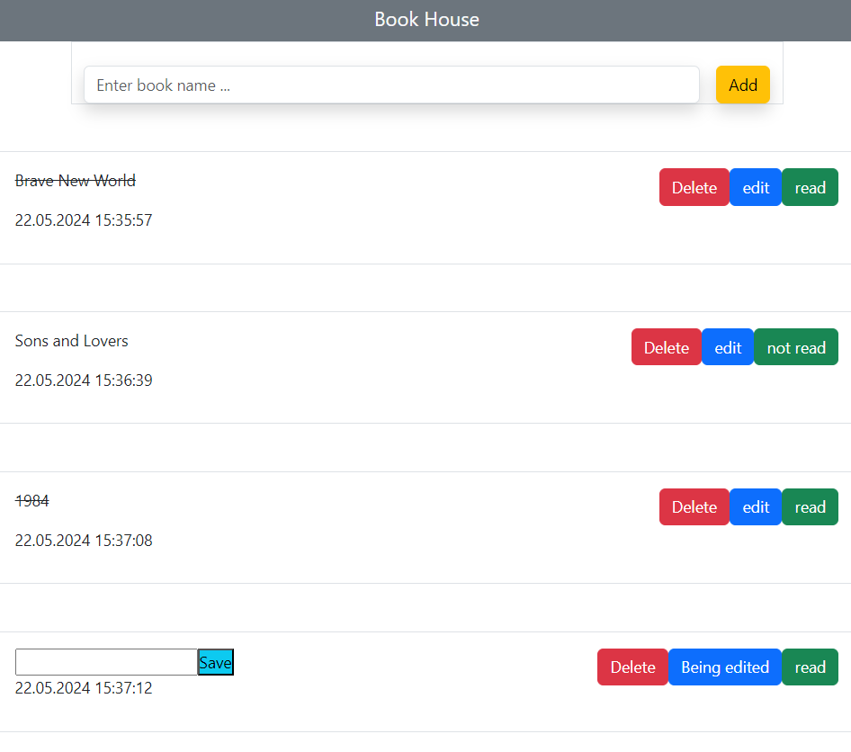
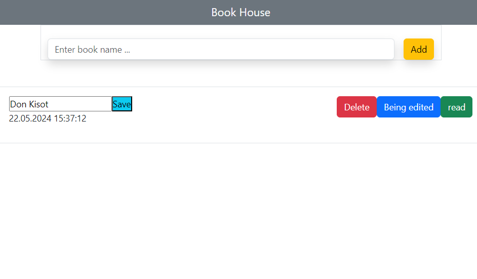

# BOOK HOUSE 

In this project, users can create a book list. They can add, delete, or edit books in the list. Additionally, they can check whether a book has been read or not.

## Used Technologies

- Javascript
- React
- Bootstrap

## Screenshoots

